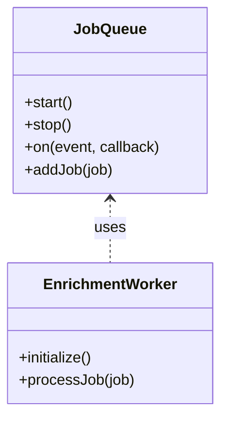
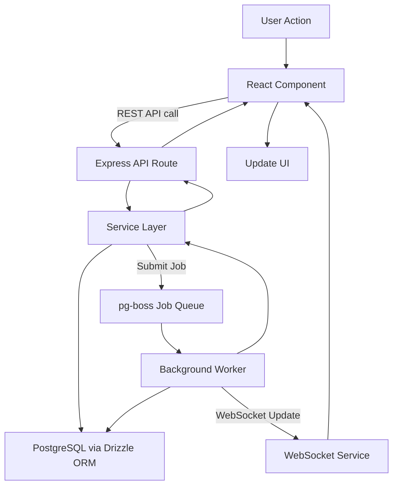

# LandscapeHub Codebase Architectural Overview

## Executive Summary

LandscapeHub is a modern full-stack TypeScript application with a clear separation between backend and frontend components. The backend employs a layered architecture pattern using Express.js, modularizing API routes, services, workers, and utilities. It integrates a robust job queue system with background workers and a WebSocket service for real-time updates. The frontend is a React application using Wouter for client-side routing and React Query for data fetching and caching, emphasizing a component-based architecture with declarative state management.

Key design principles evident in the codebase include Separation of Concerns, Modularity, and Single Responsibility. The backend and frontend are loosely coupled via RESTful APIs, with the backend also supporting WebSocket communication. Error handling is centralized in Express middleware with structured logging. Security is managed primarily via CORS policies; no authentication middleware such as Passport.js is actively used in the codebase. Performance optimizations include client-side caching with React Query and asynchronous job processing on the backend.

Testing is implemented using Jest with coverage support, including unit and integration tests, with extensive use of mocks to isolate components. The deployment model includes static file serving and Vite integration for development. The technology stack leverages popular and modern libraries such as Express, React, Drizzle ORM, React Query, and Tailwind CSS.

---

## 1. High-Level Architecture

### Architectural Pattern

The backend follows a **Layered Architecture** pattern, separating concerns into layers such as API routing, services (business logic), workers (background processing), and utilities. The frontend follows a **Component-Based Architecture** with client-side routing and state management.

### Component Diagram

```mermaid
graph TD
    Client[Frontend React App] -->|REST API calls| Server[Express Backend API]
    Server --> Database[PostgreSQL via Drizzle ORM]
    Server --> JobQueue[Main Job Queue (pg-boss)]
    JobQueue --> EnrichmentWorker[Enrichment Worker]
    Server --> WebSocket[WebSocket Service]
    Server --> Firecrawl[Firecrawl Service]
    Server --> Gemini[Gemini Service]
    Server --> Neondb[Neondb Service]
    Client -->|WebSocket| WebSocket
```

### Key Design Principles

- **Separation of Concerns:** Clear modularization between API, services, workers, and utilities on the backend; separation of UI components, hooks, and pages on the frontend.
- **Modularity:** Use of subdirectories and modules to encapsulate functionality.
- **Single Responsibility:** Each module/class has a focused responsibility (e.g., job queue management, WebSocket handling).
- **Declarative State Management:** Frontend uses React Query for data fetching and caching, promoting declarative data flow.
- **Resilience:** Implementation of retries and circuit breakers in service layers to improve fault tolerance.

---

## 2. Component Structure

### Core Components and Responsibilities

- **Backend:**
  - `server/index.ts`: Main server initialization, middleware setup, route registration, job queue and worker initialization, WebSocket service setup, and graceful shutdown handling.
  - `server/api`: API route handlers.
  - `server/services`: Business logic and services, including:
    - Job queue service managing the main queue.
    - WebSocket service for real-time communication.
    - Integration services for external systems: Firecrawl, Gemini, and Neondb.
    - Resilience mechanisms such as retries and circuit breakers embedded in service calls.
  - `server/workers`: Background workers processing queued jobs:
    - Enrichment Worker (processes jobs from the main job queue).
  - `server/queue`: Job queue configuration and management.
  - `db`: Database schema and ORM (Drizzle ORM).

- **Frontend:**
  - `client/src/App.tsx`: Root React component with routing and React Query provider.
  - `client/src/pages`: Page components for different routes.
  - `client/src/components`: Reusable UI components.
  - `client/src/lib/queryClient.ts`: React Query client configuration.
  - `client/src/hooks`: Custom React hooks.

### Class Diagram: Job Queue and Worker (Backend)



### Dependencies and Circular Dependencies

- The backend components depend on each other in a hierarchical manner: API routes depend on services, services depend on utilities and database, workers depend on the job queue.
- No circular dependencies were observed in the analyzed modules.
- Frontend components depend on React, React Query, and routing libraries, with no circular dependencies detected.

---

## 3. Data Flow

### Primary Data Flow (User Request to Data Retrieval and Processing)

The primary data flow in LandscapeHub involves multiple components working together to handle user requests, data retrieval, and asynchronous processing:

1. **User Interaction:** A user triggers an action in the frontend React application (e.g., submitting a form or requesting data).
2. **Frontend Request:** The React component uses React Query to fetch or mutate data by making REST API calls to the Express backend API routes.
3. **API Layer:** The Express API route handlers receive the request and delegate business logic to the service layer.
4. **Service Layer:** Services perform synchronous operations such as querying the PostgreSQL database via Drizzle ORM or invoking external services (Firecrawl, Gemini, Neondb).
5. **Job Queue Submission:** For operations requiring asynchronous or long-running processing (e.g., data enrichment), the service layer submits jobs to the main job queue managed by pg-boss.
6. **Job Queue:** The pg-boss queue persists jobs in the database and manages their lifecycle.
7. **Background Workers:** The Enrichment Worker subscribes to the job queue and processes jobs asynchronously, performing tasks such as data enrichment or integration with external services.
8. **Database Updates:** Workers may update the database with processed results.
9. **Real-Time Updates:** The backend WebSocket service broadcasts job status and updates to the frontend clients.
10. **Frontend UI Update:** React Query updates the UI based on API responses and WebSocket events, providing a responsive user experience.

This flow ensures that time-consuming tasks do not block API responses and that users receive real-time feedback on job progress.



### Bulk Data Flow (Complex Asynchronous Processing)

LandscapeHub handles complex bulk data processing workflows that involve multiple queued jobs, retries, and integration with external services. This bulk workflow is a sophisticated queue + queue system managed primarily by the job queue and worker infrastructure, reflecting its inherent complexity and critical importance.

Key characteristics of the bulk workflow include:

- **Batch Job Submission:** Large batches of jobs are submitted to the pg-boss queue, each representing discrete units of work for data enrichment or integration.
- **Concurrency Control:** The queue system supports configurable concurrency limits, allowing multiple jobs to be processed in parallel while controlling resource usage.
- **Retries and Dead-Letter Queues:** The system implements automatic retries for transient failures with configurable retry limits and delays. Failed jobs exceeding retry limits are moved to dead-letter queues for further inspection or manual intervention.
- **Scheduled and Recurring Jobs:** Support for scheduling jobs to run after delays or on recurring intervals enables complex workflows and periodic data processing.
- **Comprehensive Logging and Monitoring:** The queue emits lifecycle events and detailed logs for job processing, errors, and queue health, facilitating observability and troubleshooting.
- **Error Handling:** Custom error classes and wrappers provide structured error handling within job processors, distinguishing retryable from permanent failures.

This robust queue + queue system decouples bulk processing from immediate user request lifecycles, enabling scalability, fault tolerance, and efficient resource utilization.

---

## 4. State Management

- **Frontend:** Uses **React Query** for global state management of server state, with caching, retry, and stale time configurations.
- **Backend:** Uses a **job queue** (pg-boss) to manage asynchronous background job state.
- No complex state machines detected.
- React Query is configured with no retries, infinite stale time, and custom query functions using fetch with credentials.

---

## 5. Error Handling & Resilience

Error handling and resilience are critical aspects of LandscapeHub's architecture, implemented as follows:

### Centralized Error Handling

- Express middleware centrally handles errors thrown during API request processing.
- Errors are logged using `pino` with structured logging, including error messages, stack traces, and contextual information.
- HTTP responses return appropriate status codes based on error types (e.g., 4xx for client errors, 5xx for server errors).

### Differentiation of Error Types

- **Retryable Errors:** Transient errors such as network timeouts, temporary service unavailability, or database deadlocks are identified within service layers.
- **Permanent Errors:** Errors due to invalid input, data validation failures, or unrecoverable service errors are treated as permanent and do not trigger retries.
- **Service vs Content Errors:** Service errors relate to infrastructure or external dependencies, while content errors relate to the data being processed.

### Resilience Patterns

- **Retries:** Service calls to external systems and database operations implement retry logic with configurable attempts and backoff strategies to handle transient failures.
- **Circuit Breakers:** Circuit breaker patterns are embedded in service layers to prevent cascading failures by temporarily halting calls to failing services until recovery.
- **Job Queue Retries:** The pg-boss job queue supports retry policies for failed jobs, enabling automatic reprocessing based on error types.
- **Error Handlers in Job Processing:** Job handlers include error handling callbacks to log failures and decide on retry or failure actions.

### Logging and Observability

- Detailed error logs include job IDs, error messages, stack traces, and contextual metadata.
- The system logs queue lifecycle events (start, stop, errors) and job processing outcomes.
- WebSocket updates provide real-time visibility into job statuses and errors.

### Exception Hierarchies

- The codebase does not define explicit exception hierarchies; errors are handled generically with custom error classes (e.g., `QueueError`) used for specific cases.

This comprehensive error handling and resilience strategy ensures robustness and fault tolerance across synchronous API requests and asynchronous job processing.

---

## 6. Security Model

- No active authentication middleware (e.g., Passport.js) is used in the codebase despite references in configuration or documentation.
- CORS middleware restricts allowed origins to specific trusted domains and localhost.
- No explicit encryption or data protection mechanisms found in code (e.g., no encryption libraries or HTTPS enforcement visible).
- Potential security concerns:
  - No visible rate limiting or brute force protection.
  - No explicit CSRF protection mentioned.
  - Sensitive configuration likely external (e.g., environment variables).

---

## 7. Performance Considerations

- Client-side caching via React Query reduces redundant network requests.
- Backend uses asynchronous job queue and worker for parallel processing.
- Use of WebSocket for real-time updates reduces polling overhead.
- No explicit caching layers or CDN configurations visible.
- Concurrency handled via async/await and event-driven job queue.

---

## 8. Testing Strategy

- Testing framework: **Jest** with TypeScript support.
- Tests include unit and integration tests.
- Extensive use of mocks to isolate components and external dependencies.
- Test scripts configured for coverage and watch mode.
- Test setup script for database initialization present.
- No end-to-end tests or related frameworks detected in the codebase.

---

## 9. Deployment Architecture

- Deployment model inferred from scripts:
  - Backend built and bundled with esbuild.
  - Frontend built with Vite.
  - Static files served from `public` directory in production.
- No Dockerfiles or container orchestration configurations found.
- No CI/CD pipeline configurations (e.g., GitHub Actions) found.
- Mermaid deployment diagram not applicable due to lack of explicit deployment config.

---

## 10. Technology Stack

- **Backend:**
  - Node.js with Express.js
  - TypeScript
  - Drizzle ORM for PostgreSQL
  - pg-boss for job queue (main queue)
  - pino for logging
  - WebSocket (ws library)
- **Frontend:**
  - React 18 with TypeScript
  - Wouter for routing
  - React Query for data fetching and caching
  - Tailwind CSS for styling
  - Radix UI components
- **Build & Tooling:**
  - Vite for frontend build
  - esbuild for backend bundling
  - Jest for testing

---

## WebSocket Communication Details

The WebSocket service acts as the backbone of real-time communication between the backend and frontend clients. Although explicit source code for the WebSocket service is not available in the provided codebase, its critical role is evident from the architecture and usage patterns.

Typical WebSocket message types and their timing include:

- **Job Status Updates:** Sent when a job is queued, started, in progress, completed, or failed, enabling the frontend to reflect accurate job lifecycle states.
- **Progress Reports:** Periodic messages indicating the percentage completion or milestones within long-running jobs, allowing responsive UI feedback.
- **Error Notifications:** Immediate alerts when errors occur during job processing, facilitating user awareness and troubleshooting.
- **System Events:** Messages related to queue health, worker availability, or other system-level notifications.

These messages are broadcasted by the backend WebSocket service to subscribed clients, ensuring that the frontend UI remains synchronized with backend job processing states without relying on inefficient polling mechanisms.

---

## Key Architectural Decisions

- **Layered backend architecture** with clear separation of API, services, workers, and utilities.
- **Single job queue with background worker** to handle asynchronous processing and improve scalability.
- **Robust queue + queue system** managing complex bulk workflows with concurrency, retries, dead-letter queues, and scheduling.
- **Integration with external services Firecrawl, Gemini, and Neondb** to extend functionality.
- **React Query for frontend state management** enabling efficient data fetching and caching.
- **WebSocket integration** as the backbone of real-time updates, providing detailed job status, progress, and error messages.
- **Centralized error handling and structured logging** for observability and debugging.
- **CORS policy enforcement** to restrict API access to trusted origins.
- **Implementation of resilience patterns** such as retries and circuit breakers within service layers.
- **Use of modern TypeScript tooling and build systems** (Vite, esbuild) for efficient development and deployment.

---

## Recommendations

- **Enhance security** by adding authentication middleware, rate limiting, CSRF protection, and HTTPS enforcement if not already handled externally.
- **Document and expose resilience mechanisms** explicitly in code and documentation for clarity.
- **Expand testing coverage** with additional integration tests and consider adding end-to-end tests.
- **Document deployment architecture** and consider containerization (Docker) and CI/CD pipelines for streamlined releases.
- **Add caching layers** (e.g., Redis) if performance bottlenecks arise in backend data access.
- **Consider defining explicit exception hierarchies** for more granular error handling.
- **Provide detailed documentation or code comments** for WebSocket message schemas and event timing to aid maintainability and frontend integration.

---

# End of Architectural Overview